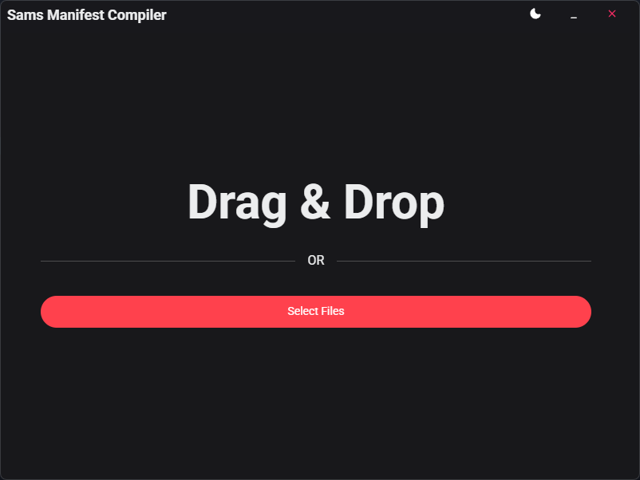
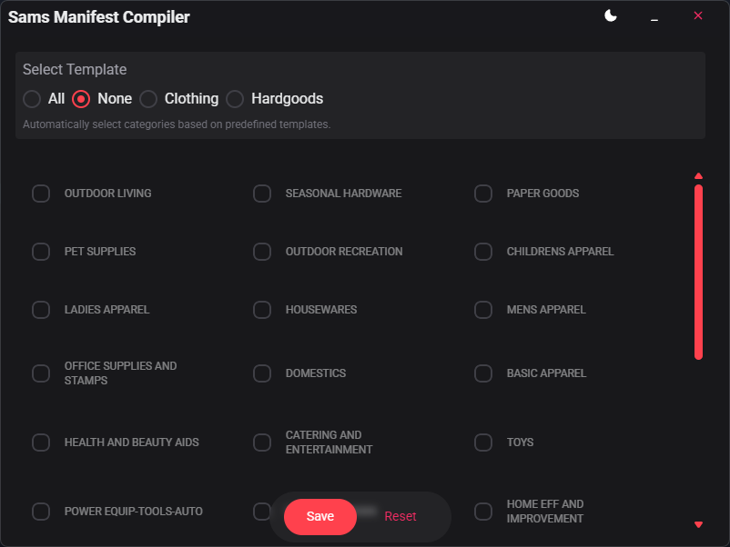

# Sam's Manifest Compiler

A desktop application designed for **Mardens Inc** internal use to compile and process Sam's Club manifest files into unified CSV tables with category filtering capabilities.

## 📋 Overview

This Tauri-based application streamlines the process of handling Sam's Club manifest files by providing an intuitive drag-and-drop interface for file processing and category-based filtering. The application parses complex manifest files and allows users to export filtered data based on predefined category templates or custom selections.

## ✨ Features

- **Drag & Drop Interface**: Intuitive file selection with visual feedback
- **Multi-file Processing**: Handle multiple CSV manifest files simultaneously
- **Category Filtering**: Filter items by product categories with predefined templates
- **Template System**: 
  - **Clothing Template**: Categories 23, 33, 22
  - **Hardgoods Template**: Categories 12, 16, 94, 8, 66, 3, 21, 2, 53, 7, 10, 9, 11, 68, 5, 6, 47, 18, 4, 31, 89, 61, 13, 88, 29, 17
- **Custom Category Selection**: Manual selection of specific categories
- **CSV Export**: Export filtered results to new CSV files
- **Error Handling**: Comprehensive error handling with user-friendly notifications
- **Modern UI**: Clean, responsive interface with smooth animations

## 🚀 Technologies Used

### Frontend
- **React 18.2.0** - UI framework
- **TypeScript** - Type safety and developer experience
- **Tauri 2.x** - Desktop application framework
- **HeroUI React** - Modern UI component library
- **Framer Motion** - Smooth animations and transitions
- **TailwindCSS** - Utility-first CSS framework
- **Vite** - Fast build tool and development server

### Backend
- **Rust** - High-performance backend processing
- **Tauri** - Native desktop integration
- **Serde** - Serialization/deserialization
- **CSV Crate** - CSV file processing
- **Anyhow** - Error handling

## 📊 Data Structure

The application processes manifest files with the following data structure:

```typescript
type Manifest = {
    description: string;
    item_number: string;
    upc_number: string;
    category: number;
    category_description: string;
    quantity: number;
    retail_per_item: number;
    liquidation_rate: number;
    liquidation_price: number;
}
```

## 🛠️ How to Build

### Prerequisites
- **Node.js** (v18 or higher)
- **pnpm** package manager
- **Rust** (latest stable version)
- **Tauri CLI**

### Development Setup

1. **Clone the repository**
   ```bash
   git clone <repository-url>
   cd sams-manifest-compiler
   ```

2. **Install dependencies**
   ```bash
   pnpm install
   ```

3. **Install Tauri CLI** (if not already installed)
   ```bash
   pnpm add -g @tauri-apps/cli
   ```

4. **Run in development mode**
   ```bash
   pnpm tauri-dev
   ```

### Building for Production

1. **Build the application**
   ```bash
   pnpm tauri-build
   ```

2. **Executable will be generated in:**
   ```
   src-tauri/target/release/bundle/
   ```

## 📖 Usage

### Getting Started

1. **Launch the Application**
   - Run the executable or use `pnpm tauri-dev` for development

2. **Load Manifest Files**
   - **Drag & Drop**: Drag CSV files directly onto the application window
   - **File Browser**: Click "Select Files" to browse for CSV files
   - Only `.csv` files are accepted

3. **Select Categories**
   - Choose from predefined templates:
     - **All**: Select all available categories
     - **None**: Deselect all categories
     - **Clothing**: Select clothing-related categories
     - **Hardgoods**: Select hardgoods categories
   - Or manually select specific categories from the grid

4. **Export Results**
   - Click "Save" to export filtered data
   - Choose destination and filename for the output CSV
   - Click "Reset" to start over with new files

### File Format Requirements

The application expects CSV files with the following format:
- Files should contain "Item list" sections
- Each section should have columns: Description, ItemNumber, UPC Number, Category, Category description, Qty, Retail per item (USD$), Liquidation rate %, Liquidation price (USD$)
- Currency values should be formatted with $ symbol
- Percentage values should include % symbol

### Category Templates

**Clothing Template (Categories: 23, 33, 22)**
- Designed for apparel and clothing items

**Hardgoods Template (Categories: 12, 16, 94, 8, 66, 3, 21, 2, 53, 7, 10, 9, 11, 68, 5, 6, 47, 18, 4, 31, 89, 61, 13, 88, 29, 17)**
- Designed for non-clothing merchandise and hard goods

## 🏗️ Architecture

### Application Structure
```
src/
├── assets/
│   ├── components/
│   │   ├── DragDropArea.tsx      # File input interface
│   │   ├── SelectCategoriesToExport.tsx  # Category selection
│   │   └── Navigation.tsx        # App navigation
│   ├── pages/
│   │   └── Home.tsx             # Main application logic
│   ├── ts/
│   │   └── manifest_parser.ts   # Frontend API interactions
│   └── css/
└── src-tauri/
    └── src/
        ├── commands.rs          # Tauri command handlers
        ├── manifest_parser.rs   # Core parsing logic
        └── main.rs             # Application entry point
```

### Key Components

- **DragDropArea**: Handles file input via drag-and-drop or file browser
- **SelectCategoriesToExport**: Manages category selection and templates
- **manifest_parser.rs**: Core Rust logic for parsing manifest files
- **commands.rs**: Tauri command interface between frontend and backend

## 🔧 Configuration

### Application Settings
- **Window Size**: 800x600 pixels
- **Resizable**: No (fixed size for consistent UX)
- **Decorations**: Custom (frameless window)

### Build Configuration
- **Bundle Targets**: All platforms
- **Frontend**: React + TypeScript + Vite
- **Backend**: Rust + Tauri

## 📄 License

GPL-3.0-or-later

## 👤 Author

Drew Chase

## 🔍 Troubleshooting

### Common Issues

1. **File not recognized**
   - Ensure files have `.csv` extension
   - Check that files contain "Item list" sections

2. **Empty results**
   - Verify CSV format matches expected structure
   - Check that selected categories exist in the data

3. **Build errors**
   - Ensure all dependencies are installed
   - Check Rust and Node.js versions

## 📸 Screenshots

   
*Main interface with drag & drop functionality*

   
*Category selection with template options*

## 🎥 Demo Video


---

*This application is designed specifically for Mardens Inc internal operations and manifest processing workflows.*
